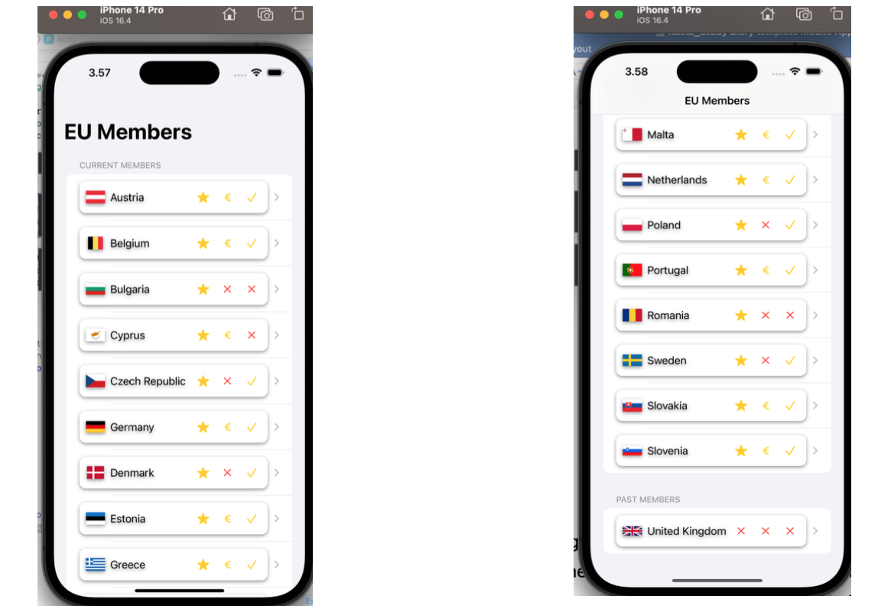
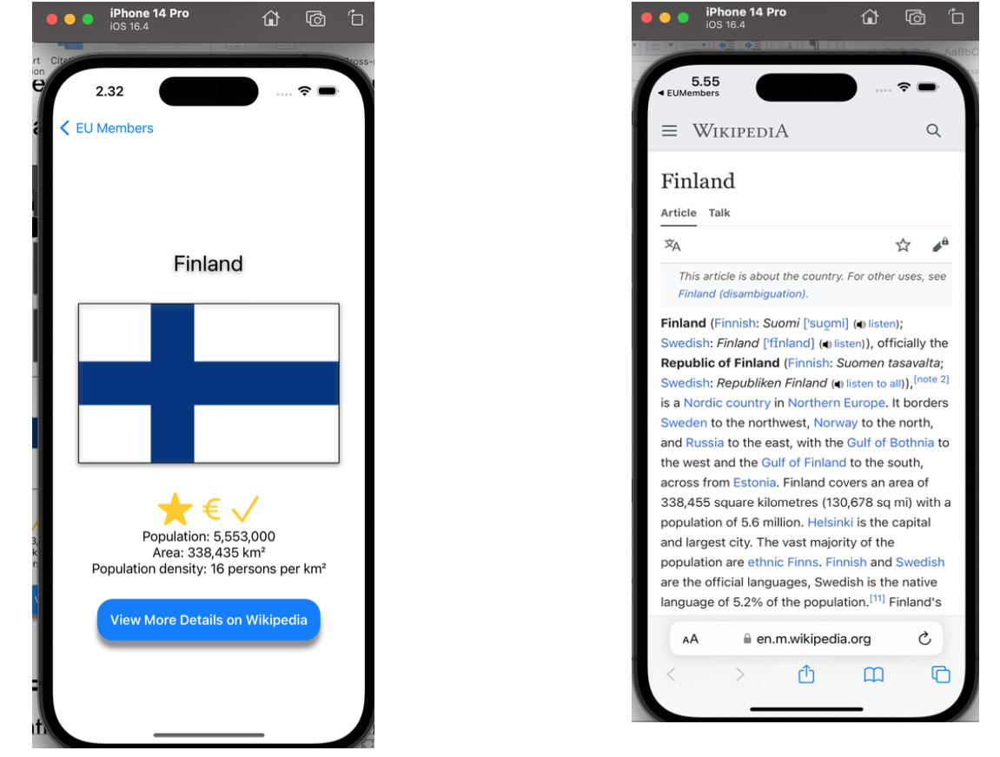

# EU Members App

This iOS app displays information about European Union (EU) member countries, including details about their EU membership, Eurozone participation, and Schengen Area membership. The app uses SwiftUI for the user interface.

## Table of Contents

- [Introduction](#introduction)
- [Features](#features)
- [Project Structure](#project-structure)
- [Getting Started](#getting-started)
- [Dependencies](#dependencies)
- [Screenshots](#screenshots)
- [Contributing](#contributing)
- [License](#license)

## Introduction

The EU Members app provides users with information about EU member countries, their current membership status, Eurozone participation, and Schengen Area membership. Users can explore details about each country, such as population, area, and population density.

## Features

- List of EU member countries categorized as current members and past members.
- Display of country details, including population, area, and population density.
- Visual representation of EU membership, Eurozone participation, and Schengen Area membership.

## Project Structure

- **EUMembersApp**: The main app entry point and configuration.
- **CountryManager**: A class responsible for managing the list of countries and loading data from an external source.
- **Country**: A struct representing a country with its properties.
- **ContentView**: The main view displaying a list of EU member countries.
- **CountryView**: Detailed view for each country, including additional information and Wikipedia link.
- **CountryDetailsView**: View displaying additional details about a country.
- **MembershipView**: View displaying icons for EU membership, Eurozone participation, and Schengen Area membership.
- **Custom_Row_View**: Custom row view for displaying countries in the list.

## Getting Started

1. Clone the repository:

   ```bash
   git clone <repository-url>

## Open the project in Xcode.

## Build and run the app.

# Dependencies
- **SwiftUI**: Apple's modern UI framework.
- **Foundation**: Provides fundamental building blocks for the app.
## Screenshots




## Contributing
- Contributions are welcome! Feel free to open issues or pull requests.